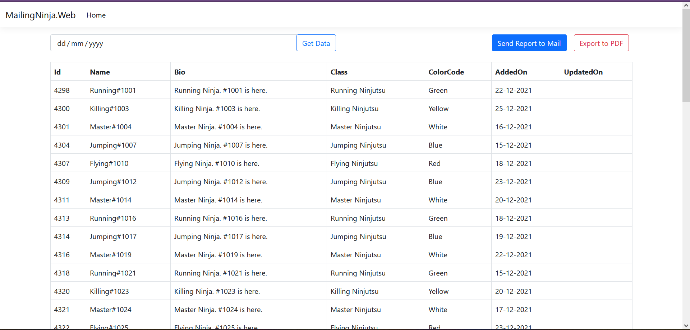
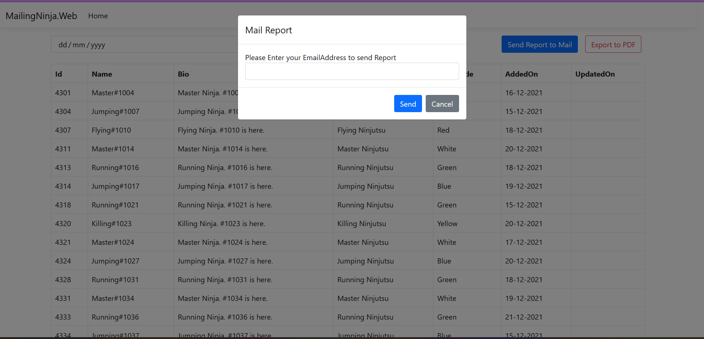
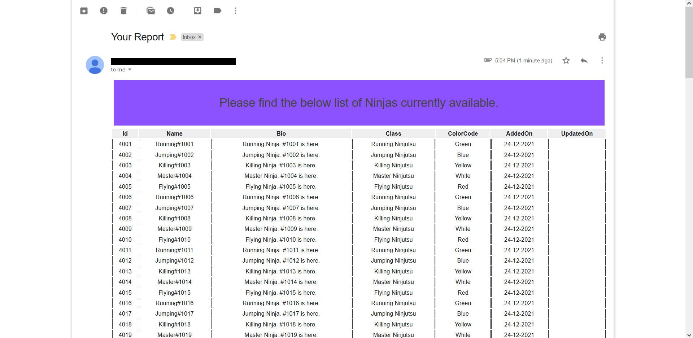
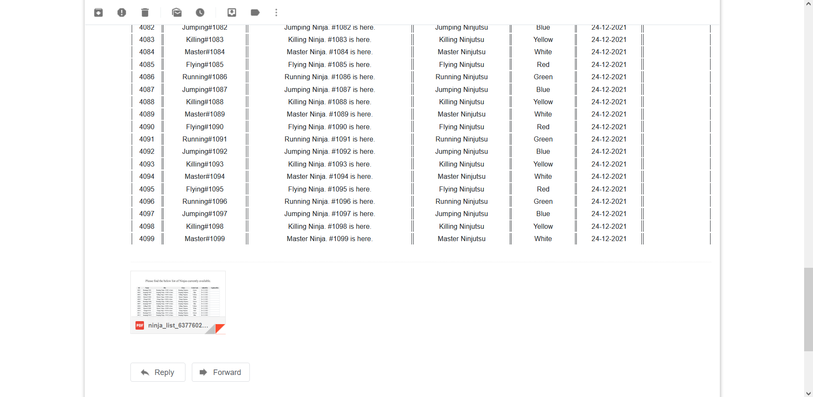
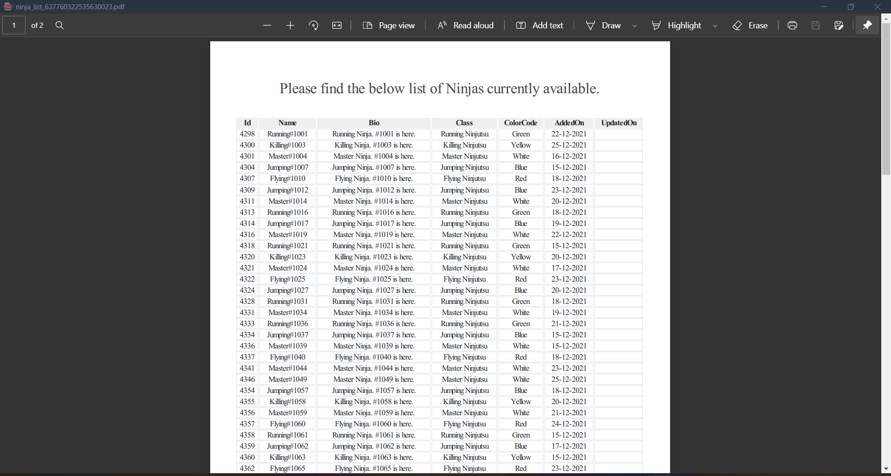

# MailingNinja

MailingNinja is a simple boilerplate solution that demonstrates sending mails with attachments from an ASP.NET Core (.NET 6) application using MailKit and MimeKit.

# Key Takeaways

The application demonstrates three key functionalities which are common in business applications.

1. Generating HTML from Razor Views which are rendered with data using RazorViewEngine
2. Generating a PDF report from HTML and downloading via ASP.NET Core (.NET 6) MVC using DinkToPdf
3. Sending HTML content (with and without Attachments) from the application using MailKit and MimeKit 

# What is RazorViewEngine?

RazorViewEngine is a view engine that converts the razor powered cshtml files in an MVC application into plain HTML documents which the browser can understand. It takes care of the variable resolution, loops and other control structures of the Razor syntax and processes them to form the HTML only which the browser can render and display to the user.

For starters, An MVC application developed over the ASP.NET framework internally uses Razor to render html views and data over layout files during a request. Applications developed using ASP.NET can make use of an external library called RazorEngine which levarages the Razor engine capabilities of the MVC framework. 

Although RazorEngine plugin has no direct support for ASP.NET Core, the aspnetcore framework still comes with the razor engine which provides helper methods which can by-produce the rendered HTML over the passed model data and return the plain HTML along.

# What is DinkToPdf?

DinkToPdf is a .NET library which can generate PDF from an input content. The library offers customizations such as Page Layouts, Numbering, Headers, Footers and so on. We can pass in a HTML string to the library and it returns PDF bytes which can be further written onto a File.

# The Solution offers the following:

1. Demonstration of Generating Dynamic HTML content for input data through Razor Views
2. Writing the generated dynamic HTML content into PDF and downloading it (through FileResult)
3. Configuring SMTP and sending out the dynamic HTML content as an Email
4. Sending out the generated PDF content as an attachment to the above sent Email 
5. CQRS with MediatR
6. Repositories and UnitOfWork
7. SQLite Database integration
8. Clean Architecture with decoupled layers

# Technologies

1. ASP.NET Core (.NET 6)
2. EF Core and SQLite
3. MediatR
4. MailKit and MimeKit
5. DinkToPdf

# Output

# Resources

You can refer to the below articles to better understand the solution:

* [Fetch Rendered View HTML in ASP.NET Core using Razor](https://referbruv.com/blog/posts/template-based-emails-fetch-rendered-view-html-in-aspnet-core-using-razor)
* [Sending HTML Content over Email Using MailKit](https://referbruv.com/blog/posts/template-based-emails-sending-html-content-over-email-using-mailkit)
* [Embedding Images to Content using MimeKit](https://referbruv.com/blog/posts/template-based-emails-adding-and-embedding-images-to-content-using-mimekit)

# Support Me

For more detailed articles and how-to guides, visit https://referbruv.com

Liked my work? You can support me by buying me a coffee!

